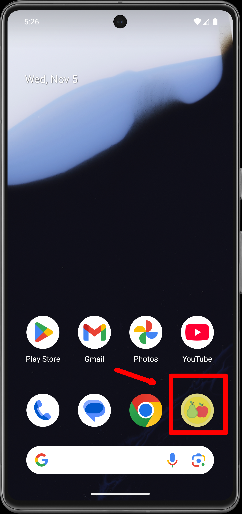
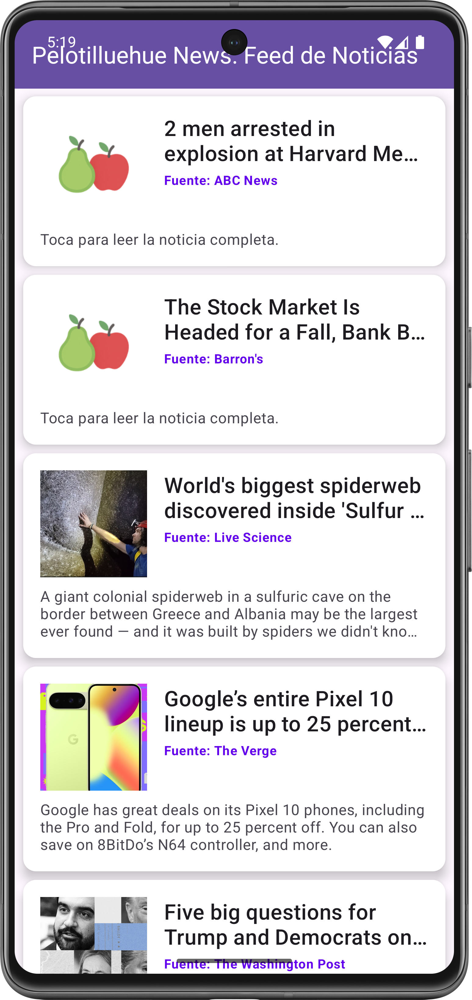
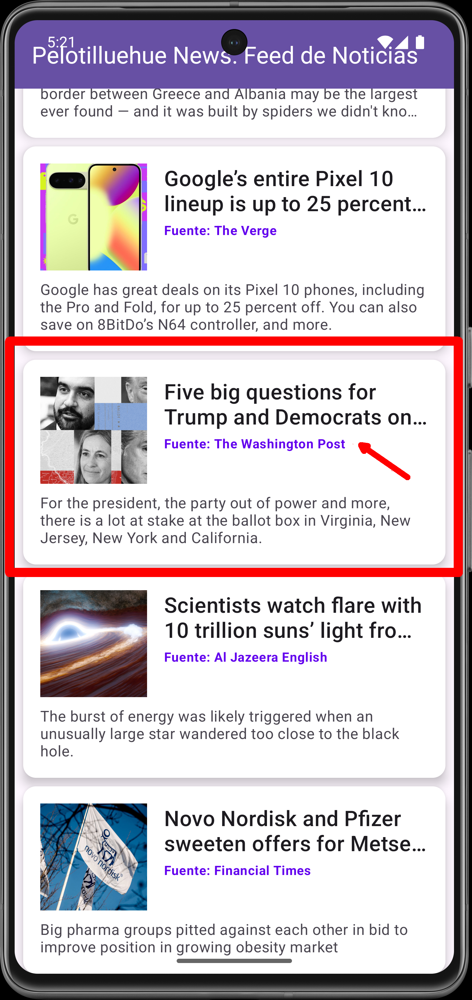

# 🚀 MOD6 AE2-AB1: Pelotillehue News - (APIRest + Retrofit + MVVM)

<p float="center">
  
</p>

Aplicación nativa para Android desarrollada en Kotlin, diseñada para obtener y mostrar un feed dinámico con noticias recientes desde un una fuente externa (NewsAPI.org) mediante el consumo de una API REST. La aplicación utiliza una arquitectura robusta basada en el patrón Model-View-ViewModel (MVVM), utilizando Retrofit para todas las operaciones de red y LiveData para gestionar la actualización reactiva de la interfaz de usuario (UI) asegurando reactividad, mantenibilidad y una clara aplicación de principios SOLID.

Se ha puesto especial énfasis en la estabilidad y la experiencia del usuario, integrando la solución de Pestañas Personalizadas de Chrome (CustomTabsIntent) para la visualización de los enlaces completos de las noticias, previniendo así problemas de agotamiento de recursos del sistema (Out-Of-Memory) al navegar fuera de la aplicación.

El objetivo principal ha sido demostrar la integración robusta de los componentes de Android
para crear una app escalable, separando la lógica de negocio de la UI, asegurando concurrencia
mediante Kotlin Coroutines.

---

## 🎯 Requerimientos de Funcionalidad y su Implementación

| Requerimiento                                    | Implementación                                                                                                                                                                                                                |
| ------------------------------------------------ | ----------------------------------------------------------------------------------------------------------------------------------------------------------------------------------------------------------------------------- |
| 1. Consumo de API REST (NewsAPI)                 | Uso de Retrofit para definir la interfaz de servicio y gestionar las llamadas HTTP a top-headlines.                                                                                                                           |
| 2. Visualización de Noticias                     | Un RecyclerView muestra el listado de noticias utilizando el layout item_article.xml con un diseño de CardView moderno.                                                                                                       |
| 3. Carga Asíncrona de Imágenes                   | Integración de Glide para manejar la descarga, caché y visualización eficiente de las miniaturas de imágenes (urlToImage), incluyendo placeholders y manejo de errores.                                                       |
| 4. Navegación Estable a Enlaces (UX/Estabilidad) | Implementación de CustomTabsIntent (Pestañas Personalizadas de Chrome) para abrir los enlaces de las noticias. Esto aísla el proceso de navegación, previene crashes por memoria y asegura una rápida vuelta a la aplicación. |
| 5. Manejo de Estados de UI                       | La MainActivity observa el ViewModel para mostrar/ocultar un ProgressBar durante la carga y un TextView para mensajes de error o cuando no hay resultados.                                                                    |

---

## 🧠 Arquitectura y Tecnología: MVVM y Jetpack

El proyecto utiliza el patrón MVVM (Model-View-ViewModel) para dividir la lógica del proyecto en capas específicas.

1. Modelo (Model) y Persistencia (Room)

| Componente                       | Descripción                                                                                                                                                                       |
| -------------------------------- | --------------------------------------------------------------------------------------------------------------------------------------------------------------------------------- |
| Modelos DTO                      | Clases (NewsDataModels.kt, NewsResponse.kt, ArticleDto, SourceDto) que reflejan la estructura JSON de la API. Incluyen funciones toDomain() para mapeo y limpieza de datos nulos. |
| ApiService.kt                    | Interfaz de Retrofit que define las funciones @GET suspendidas para las llamadasa la API (ej. suspend fun getTopHeadlines():Response `<NewsResponse>` ).                          |
| Repositorio ( NewsRepository.kt) | Centraliza la fuente de datos. Llama a ApiService.kt y encapsula la lógica de red, transformando el resultado en un formato usable por el ViewModel                               |

2. ViewModel (NewsViewModel.kt)

- Hereda de `ViewModel`.
- Hereda de ViewModel .
- Utiliza viewModelScope.launch para ejecutar las operaciones de red (a través del Repository) de forma asíncrona y segura (I/O).
- Lógica de Red: Contiene el método fetchNews(query: String) que llama al repositorio para obtener los datos de la APINews.
- Expone el estado de la aplicación a la Vista a través de LiveData : - articlesFeed : La lista de artículos de noticias para actualizar el RecyclerView . - isLoading : Estado booleano para mostrar/ocultar un indicador de progreso. - errorMsg : Mensaje de error para notificar al usuario sobre fallos de red o API.

3. Vista (View) - MainActivity.kt

- Es el contenedor principal de la aplicación.
- Orquestación: Inicializa el NewsViewModel y el NewsRepository .
- Interacción con UI:
  - Gestiona los listeners de los elementos de búsqueda y filtrado.
  - Observación Reactiva: Observa viewModel.articlesFeed para actualizar el RecyclerView con
    las noticias.
  - Gestión de Estados: Observa viewModel.isLoading y viewModel.errorMsg para manejar la UI de carga y error.

---

## ✨ Reactividad y Flujo de Datos

El flujo de datos está diseñado para ser completamente reactivo, desde la solicitud de red hasta la
visualización en la UI:

1. Disparo de la solicitud: El usuario realiza una búsqueda, la View llama a `viewModel.fetchNews(query)` .
2. Red asíncrona: El **ViewModel** utiliza `viewModelScope.launch` para llamar a `repository.getNews`.
3. Respuesta de la API: **Retrofit** realiza la solicitud HTTP. Una vez completada, deserializa el JSON en el Modelo de Datos (NewsResponse).
4. Actualización de LiveData: El ViewModel recibe la lista de Article y actualiza articlesFeed. Este cambio dispara automáticamente el observador.
5. Sincronización de UI: El observador en la View detecta el cambio en viewModel.articlesFeed y
   actualiza el RecyclerView para mostrar el nuevo feed de noticias.

---

## 🛠️ Tecnologías usadas

- **IDE** : Android Studio
- **Plataforma** : Android Nativo
- **Lenguaje** : Kotlin (1.9.22)
- **Arquitectura** : MVVM (Model-View-ViewModel).
- **Conectividad** : Retrofit 2 (API REST Client).
- **Deserialización** : GSON / Moshi.
- **Concurrencia** : Kotlin Coroutines y `viewModelScope` (Dispatchers.IO).
- **Comunicación** : LiveData (Reactividad) y View Binding.
- **UI** : RecyclerView para el listado de noticias

---

## 🏗️ Funcionamiento de la Aplicación

El flujo de la aplicación se centra en el consumo y la presentación de datos remotos:

1. Inicio y Carga: La aplicación inicia en la MainActivity / NewsFragment . El ViewModel lanza automáticamente una solicitud a la API para cargar los titulares principales. Se muestra un Spinner o barra de progreso (observando viewModel.isLoading ).Visualización: Una vez recibida la respuesta, el RecyclerView se llena con tarjetas de noticias.
2. Interacción de Búsqueda/Filtrado: El usuario ingresa un término o selecciona un filtro. Esto dispara el método fetchNews(query) en el ViewModel, iniciando un nuevo ciclo de solicitud/respuesta de la API.
3. Manejo de Errores: Si la API retorna un código de error (ej. 404 o 500) o si hay un fallo de red, el LiveData<errorMsg> se actualiza, y la UI muestra un mensaje informativo al usuario en lugar del feed.

---

## ⭐ Capturas de Pantalla

<table width="100%">
    <tr>
        <td align="center" width="33%">
            
        </td>
        <td align="center" width="33%">
            
        </td>
        <td align="center" width="33%">
            
        </td>
    </tr>
    <tr>
        <td align="center">App instalada</td>
        <td align="center">Al lanzar la App</td>
        <td align="center">Vista del feed</td>
    </tr>
    <tr>
        <td align="center">
            
        </td>
        <td align="center">
            
        </td>
        <td align="center">
            
        </td>
    </tr>
    <tr>
        <td align="center">Selección noticia</td>
        <td align="center">Despliegue</td>
        <td align="center">Otro desarrollo de **_Peras con Manzanas_**</td>
    </tr>
</table>

---

## 🔎 Guía de Ejecución del Proyecto

**Para ejecutar este proyecto en tu entorno de desarrollo, siga estos 'quick steps':**

    1.**Clonar el Repo:** Clona el proyecto en su máquina local.

    2.**Abrir en Android Studio:** Abra la carpeta del proyecto con Android Studio. El IDE detectará automáticamente la configuración de Gradle.

    3.**Sincronizar Gradle:** Haz clic en el botón "Sync Now" si Android Studio te lo solicita. Esto descargará todas las dependencias necesarias.

    4.**Ejecutar:** Conecta un dispositivo Android físico o inicia un emulador. Luego, haz clic en el botón "Run 'app'" (el ícono de la flecha verde) para desplegar la aplicación.

**Para ejecutar este proyecto en tu celular, sigue estos 'quick steps':**

    1.**Copiar la APK:** Copia la aplicación (APK) en tu celular.

    2.**Instalar:** Instala la aplicación, salta los avisos de advertencia, es normal si la aplicación no ha sido productivizada la plataforma de Android.

    3.**Abrir la App:** Haz doble clic en el ícono de _**Peras con Manzanas para abrir**_ "GesTarea V5".

    4.**Recorrer las opciones:** Cliquea en las opciones y podrás acceder al listado de eventos, editar cada evento, crear nuevos eventos, regresando a cualquier punto de la app.

---

## 🛑 Instalación y Configuración

a. **Clonar el repositorio:**

```bash

https://github.com/jcordovaj/ae2_abp1_APINews.git

```

b. **Abrir el Proyecto en Android Studio:**

b.1. Abrir Android Studio.

b.2. En la pantalla de bienvenida, seleccionar **"Open an existing Android Studio project"** (Abrir un proyecto de Android Studio existente).

b.3. Navegar a la carpeta donde se clonó el repositorio y seleccionarla. Android Studio detectará automáticamente el proyecto de Gradle y comenzará a indexar los archivos.

c. **Sincronizar Gradle:**

c.1. Este es el paso más importante. Después de abrir el proyecto, Android Studio intentará sincronizar la configuración de Gradle. Esto significa que descargará todas las librerías, dependencias y plugins necesarios para construir la aplicación. Normalmente, una barra de progreso se mostrará en la parte inferior de la consola de Android Studio con un mensaje como **"Gradle Sync in progress"**.

c.2. Si no se inicia, o si el proceso falla, intente con el botón **"Sync Project with Gradle Files"** en la barra de herramientas. Es el icono con el **"elefante" de Gradle**. Eso forzará la sincronización.

c.3. Esperar que el proceso de sincronización termine. De haber errores, puede ser por problemas en la configuración de Android u otros conflictos, la aplicación debe descargar lo que requiera y poder ser ejecutada "AS-IS".

d. **Configurar el Dispositivo o Emulador:**

Para ejecutar la aplicación, se requiere un dispositivo Android, puedes usarse el emulador virtual o un dispositivo físico.

d.1. Emulador: En la barra de herramientas, haga click en el botón del "AVD Manager" (Android Virtual Device Manager), que es el icono de un teléfono móvil con el logo de Android. Desde ahí, puedes crear un nuevo emulador con la versión de Android que prefiera (Nota: Debe considerar que cada celular emulado, puede requerir más de 1GB de espacio en disco y recursos de memoria).

d.2. Dispositivo físico: Conecte su teléfono Android a la computadora con un cable USB (también puede ser por WI-FI). Asegúrese de que las **Opciones de desarrollador y la Depuración por USB** estén habilitadas en su dispositivo. Consulte a su fabricante para activar estas opciones.

e. **Ejecutar la aplicación:**

e.1. Seleccione el dispositivo o emulador deseado en la barra de herramientas del emulador.

e.2. Haga click en el botón "Run 'app'" (el triángulo verde en la parte superior, o vaya al menu "RUN") para iniciar la compilación y el despliegue de la aplicación, puede tardar algunos minutos, dependiendo de su computador.

e.3. Si todo ha sido configurado correctamente, la aplicación se instalará en el dispositivo y se iniciará automáticamente, mostrando la pantalla de inicio.

---

## 🎉 Contribuciones (Things-To-Do)

Se puede contribuir reportando problemas o con nuevas ideas, por favor respetar el estilo de programación y no subir código basura. Puede utilizar: forking del repositorio, crear pull requests, etc. Toda contribución es bienvenida.

---

## 🔹 Licencia

Proyecto con fines educativos.

---
